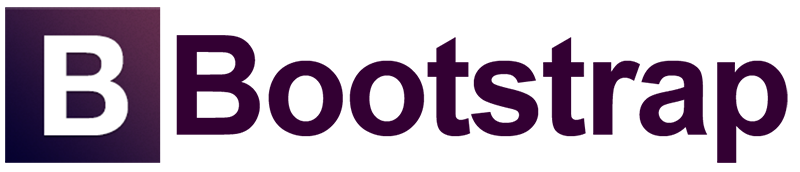
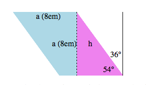
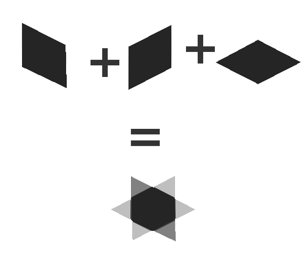

### 2. CSS

#### 2.1. Bonnes pratiques

##### 2.1.1. Nomenclature

1. Utiliser des classes uniquement pas des ID pour associer un style.
Les id # sont uniques par conséquents ne sont pas réutilisables. Elles servent d'ancres dans la page ou pour associer des interactions javascript.

2. Séparation du style et de la DOM (separation of concern).
La classe ne nomme pas le style elle nomme l'objet au quel on va appliquer un style.

Mauvaise pratique
HTML:
```html
<a href="#alert" class="red">Atttention ...</a>
```
CSS :
```css
.red {
	color: #00F;
}
```

Bonne pratique

HTML:
```html
<a href="#alert" class="lien-important" >Atttention ...</a>
```
CSS :
```css
.lien-important {
	color: #00F;
}
```

####### CSS Orienté objet

*OOCSS (Object Oriented CSS)*
http://oocss.org

- noms de classes courts
- classes réutilisables
- contextualisation
- Modules et templates élémentaires
- Grille fluide

Exemple ("media" module)

HTML: 
```html
<div class="media attribution">

  <a href="http://twitter.com/stubbornella" class="img">
    
  </a>

  <div class="bd">
    @Stubbornella 14 minutes ago
  </div>

</div>
```

CSS: 
```css
/* ====== media ====== */
.media {margin:10px;}
.media, .bd {overflow:hidden; _overflow:visible; zoom:1;}
.media .img {float:left; margin-right: 10px;}
.media .img img{display:block;}
.media .imgExt{float:right; margin-left: 10px;}
```

Inconvénients:
- Classes gigognes (imbriquées) rend analyse du CSS plus lent.
- Maintenance difficile
	- Conflits possibles
	- Surcharge souvent nécessaire

###### BEM = Block, Element, Modifier
http://bem.info/
http://csswizardry.com/2013/01/mindbemding-getting-your-head-round-bem-syntax/

- Nomenclature orienté objet 
- Tire profit des préprocesseurs CSS
- Rend compte des héritages
- Facilite la maintenance et l'évolution du site

```css
.block {}
.block__element {}
.block--modifier {}
```

Exemple

CSS: 
```css
.media {}
.media__img {}
.media__img--rev {}
.media__body {}
```

HTML: 
```html
<div class="media">
    
    <div class="media__body">
        <h3 class="alpha">Welcome to Foo Corp</h3>
        <p class="lede">Foo Corp is the best, seriously!</p>
    </div>
</div>
```

###### *CSS Lint* http://csslint.net
Outil servant à vérifier que les bonnes pratiques sont bien suivies et que le code reste lisible.

##### 2.1.2. Architecture
- Rénitialiser les style des éléments HTML (css reset)
- Identifier des modules: blocs de contenu au style et aux fonctionnalités similiaires entre les pages ou dasn une même page
- Intégrer un guide stylistique (Style Guide)
- Séparer les variables dans un même plusieurs fichiers (ex: vars.scss, colors.scss, fonts.scss, breakpoints.scss)
- Une feuille de style par module
- Une feuille de style par page
- Les espacements verticaux (vertical rythme) devraient toujours être exprimés en <b>em</b> ou <b>rem</b> car relatifs à la taille du texte.</li>
- Les espacements horizontaux devraient toujours être exprimés en % pour des "containers" et en <b>em</b> ou <b>rem</b> pour du texte.</li>

###### [KSS](http://warpspire.com/kss/styleguides/)
Permet de générer un guide stylistique d'après la documentation du code
```css
/*
A button suitable for giving stars to someone.

:hover             - Subtle hover highlight.
.stars-given       - A highlight indicating you've already given a star.
.stars-given:hover - Subtle hover highlight on top of stars-given styling.
.disabled          - Dims the button to indicate it cannot be used.

Styleguide 2.1.3.
*/
a.button.star{
  ...
}
a.button.star.stars-given{
  ...
}
a.button.star.disabled{
  ...
}
```


#### 2.2. CSS Tools and library

##### 2.2.1. Sass : Préprocesseur CSS
Sass: Syntactically Awesome Style Sheets
http://sass-lang.com/


###### Nesting / Imbrication
Permet d'éviter les répétitions de selecteurs parent, et rend le CSS plus simple. 

- Exemple:

```scss
#main {
  width: 97%;
  p, div {
    font-size: 2em;
    a { font-weight: bold; }
  }
  pre { font-size: 3em; }
}
```

Compilé donne :
```css
#main {
  width: 97%; }
  #main p, #main div {
    font-size: 2em; }
    #main p a, #main div a {
      font-weight: bold; }
  #main pre {
    font-size: 3em; }
```


- Référence au parent :  " & "

```scss
a {
  font-weight: bold;
  text-decoration: none;
  &:hover { text-decoration: underline; }
  body.firefox & { font-weight: normal; }
}
```

- Concaténation

scss :
```
#main {
  color: black;
  &-sidebar { border: 1px solid; }
}
```
css :
```
#main {
  color: black; }
  #main-sidebar {
    border: 1px solid; }
```

###### @include / @mixin
```scss
@mixin silly-links {
  a {
    color: blue;
    background-color: red;
  }
}
@include silly-links;
```

```scss
@mixin clearfix {
  display: inline-block;
  &:after {
    content: ".";
    display: block;
    height: 0;
    clear: both;
    visibility: hidden;
  }
  * html & { height: 1px }
}```

```scss
@mixin sexy-border($color, $width) {
  border: {
    color: $color;
    width: $width;
    style: dashed;
  }
}

p { @include sexy-border(blue, 1in); }
```

```scss
@mixin box-shadow($shadows...) {
  -moz-box-shadow: $shadows;
  -webkit-box-shadow: $shadows;
  box-shadow: $shadows;
}

.shadows {
  @include box-shadow(0px 4px 5px #666, 2px 6px 10px #999);
}
```


###### @extend
scss:
```scss
.error {
  border: 1px #f00;
  background-color: #fdd;
}
.seriousError {
  @extend .error;
  border-width: 3px;
}
```
css :
```css
.error, .seriousError {
  border: 1px #f00;
  background-color: #fdd;
}

.seriousError {
  border-width: 3px;
}
```
</section>


###### interpolation: #{}
```scss
$name: foo;
$attr: border;
p.#{$name} {
  #{$attr}-color: blue;
}
```

```scss
@mixin firefox-message($selector) {
  body.firefox #{$selector}:before {
    content: "Hi, Firefox users!";
  }
}
@include firefox-message(".header");
```

```scss
p:before {
  content: "I ate #{5 + 10} pies!";
}
```

```scss
p {
  $font-size: 12px;
  $line-height: 30px;
  font: #{$font-size}/#{$line-height};
}
```

###### @import
Suffix "_" désigne les "partials".

```scss
@import "foo.scss";
@import "foo";
``` 

Importe tous les deux un fichier scss. Note que l'extension est optionnelle.

"_" est implicite. On ne peut donc pas créer un partial et un "non-partial" dans le même répertoire.

Par contre les appels suivant créeer une règle css @import.

```scss
@import "foo.css";
@import "foo" screen;
@import "http://foo.com/bar";
@import url(foo);
```

##### 2.2.3. Fameworks CSS

* [Compass](http://compass-style.org/) -Ruby gem, +sprite generator, -lent
* [Bourbon.io](http://bourbon.io/) 
* [Inuit CSS](https://github.com/inuitcss) http://terabytenz.github.io/inuit.css-kitchensink/
* [Zurb Foundation](http://foundation.zurb.com/)
* [Bootstrap](http://getbootstrap.com/)





#### 2.3. CSS avancés
##### Pseudo selecteurs
```:hover```, ```:selection```, ```:focus```, ```:target``` , 

```:first-line```, ```:first-letter```

```css
p:first-letter {text-decoration: underline;}
p:first-line {color: #CB000F;}
```

```:before```, ```:after```, 

```css
@media print {
  a[href]:after {
    content: " (" attr(href) ") ";
  }
}
```

```:first-child```, ```:last-child```, ```:nth-child(N)```, ```:nth-of-type(N)```, ```:first-of-type```, ...

http://css-tricks.com/pseudo-element-roundup/
http://css-tricks.com/pseudo-class-selectors/
[:target demo](http://codepen.io/siiron/pen/pjyku)
[:target demo](http://codepen.io/Rplus/pen/orpLx)

##### Formes géométriques

###### Triangle


http://codepen.io/svassr/pen/radBMP

###### Hexagone

http://codepen.io/svassr/pen/azqeYR?editors=110

[Masque hexagonal](http://codepen.io/svassr/pen/NPyQVg?editors=110) 

###### Losange
```css
.parallelogramme {
  width: 8em; height: 8em; /* some arbitrary value */
  transform: skewX(36deg);
  background: lightblue; /*make it visible*/
}
```



http://codepen.io/svassr/pen/wBmwWq?editors=110


###### Arrondis : Border-radius
http://codepen.io/svassr/pen/QwQeZg?editors=110

Etc. : http://css-tricks.com/examples/ShapesOfCSS/


##### Animation CSS
Transition
```css
div {
    transition-property: opacity;
    transition-duration: 2s;
    /* optional */
    transition-timing-function: ease | linear | ease-in | ease-out | ease-in-out | step-start | step-end | steps(<integer>[, [ start | end ] ]?);
    transition-delay: 0.5s; 
}
```

```css
transition: all 600ms cubic-bezier(0.68, -0.55, 0.265, 1.55);
```

```css
transition: opacity 1s linear, transform ease-in-out 1.5;
```
http://codepen.io/impressivewebs/pen/zohgt?editors=110


Animation
http://codepen.io/svassr/pen/YPaKrG?editors=110

##### [Media Queries](http://css-tricks.com/css-media-queries/)
```html
<link rel='stylesheet' media='screen and (min-width: 701px) and (max-width: 900px)' href='css/medium.css' />
```

```css
@media all and (max-width: 699px) and (min-width: 520px), (min-width: 1151px) {
  body {
    background: #ccc;
  }
}
```

```css
$tablet-width: 768px;
$desktop-width: 1024px;

@mixin tablet {
  @media (min-width: #{$tablet-width}) and (max-width: #{$desktop-width - 1px}) {
    @content;
  }
}

@mixin desktop {
  @media (min-width: #{$desktop-width}) {
    @content;
  }
}
```


##### Flex-box
http://css-tricks.com/snippets/css/a-guide-to-flexbox/


##### transform
Jeu de propriétés permettant d'efectuer des transformations 2d et 3d.


http://thewebrocks.com/demos/3D-css-tester/
http://desandro.github.io/3dtransforms/

#### 2.4. Ressources
* [Can I Use](http://caniuse.com/)
* [SMACSS](http://smacss.com)
* [CSS-Tricks](css-tricks.com)
Style-guide generator
	* [Comparison article](http://welchcanavan.com/styleguide-roundup/)
	* [style-guide generator list](http://vinspee.me/style-guide-guide/)
	* https://github.com/davidhund/styleguide-generators
* https://github.com/davidhund/styleguide-generators
* pseudo selecteurs 
	* http://quirksmode.org/css/selectors/
	* http://css-tricks.com/pseudo-class-selectors/
* http://thewebrocks.com/demos/3D-css-tester/
* Shapes : http://codepen.io/thebabydino/full/ca5fdb3582a6a27e4d3988d6d90952cb
* Animation : http://css-tricks.com/css-animation-tricks/
* Media Queries
	* http://css-tricks.com/css-media-queries/
	* http://css-tricks.com/approaches-media-queries-sass/
* http://www.paulirish.com/2012/why-moving-elements-with-translate-is-better-than-posabs-topleft/
